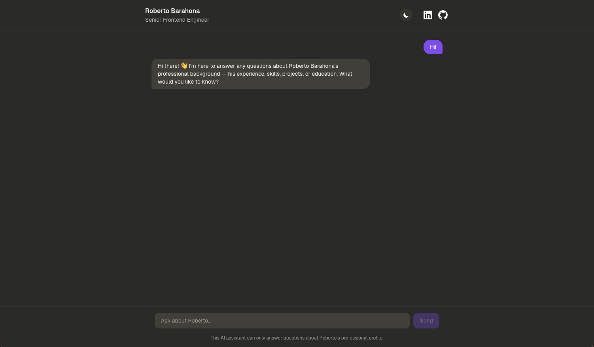

# Resume Chatbot

An AI-powered portfolio chatbot that lets recruiters interactively ask questions about **Roberto Barahona's** professional profile — instead of reading a traditional resume.

## Live Demo

[robert-barahona.dev](https://robert-barahona.dev)

## Screenshot

## Features

- **Conversational resume** — ask natural-language questions about experience, skills, and achievements, answered from a structured resume context.
- **Streaming responses** — replies are streamed from the Anthropic API and progressively revealed in the UI for a smooth, typing-like effect.
- **Scoped answers** — the assistant only answers questions related to Roberto's professional background and politely redirects anything off-topic.
- **Suggested questions** — quick-start prompts shown on the empty chat state to help recruiters get going.
- **Markdown-formatted messages** — assistant responses support rich formatting (lists, links, emphasis) via GitHub-flavored Markdown.
- **Typing indicator** — visual feedback while waiting for the assistant's response.
- **Light/dark/system theme** — toggleable theme with persistence in local storage and automatic sync with the OS preference.
- **Responsive design** — clean, mobile-friendly chat layout built with Tailwind CSS.

## Tech Stack

- [Next.js](https://nextjs.org) — App Router, API routes
- [React](https://react.dev)
- [TypeScript](https://www.typescriptlang.org)
- [Tailwind CSS](https://tailwindcss.com)
- [Anthropic SDK](https://github.com/anthropics/anthropic-sdk-typescript) — Claude-powered chat completions
- [react-markdown](https://github.com/remarkjs/react-markdown) + [remark-gfm](https://github.com/remarkjs/remark-gfm) — Markdown rendering
- [Biome](https://biomejs.dev) — linting and formatting
- [Knip](https://knip.dev) — unused code/dependency detection
- [Vercel](https://vercel.com) — deployment